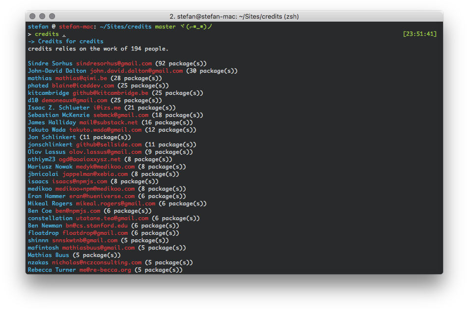

[](https://travis-ci.org/stefanjudis/credits-cli) [](https://www.npmjs.org/package/credits-cli) [](https://www.npmjs.org/package/credits-cli) [](https://coveralls.io/r/stefanjudis/credits-cli?branch=master) [](http://greenkeeper.io/)

# credits-cli
> Find out on whose work your project is based on



We all use a lot of open source projects. Really often we don't even know who is responsible for all the well done projects. You want to see who to thank for hard work?

**Use `credits` and find out on whose work your projects are based on.**

## Install

```
npm install -g credits-cli
```

## Basic usage

`credits` will check all `node_modules` recursively and evaluate the **Author** and **Maintainers** of the **installed** dependencies included in the set path.

```
Usage
  $ credits <path>

Options
  -r, --reporter Choose reporter to format output [ minimal, extended, markdown ]

Examples
  $ credits /projects/foo
  $ credits /projects/foo --reporter extended
  $ credits /projects/foo --reporter markdown > THANKS.md
```

### Examples

You can use `credits` to generate a `THANKS.md` files easily by running:

```
$ credits . --reporter markdown > THANKS.md
```

***************

#### I want to thank all these [people](./THANKS.md) for their great work!!!
